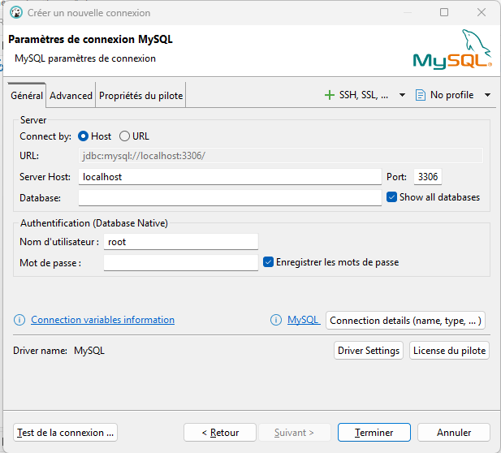

# Build a REST API with Node.js, Express, and MySQL

Building a MySQL Database Connection with Node.js and Express

## Setting up table and data

### Parameters Connection for MySQL

Create a new connection



### Create the Database and Table

- Run this query to create a new database:

```sql
CREATE DATABASE IF NOT EXISTS testdb;
```

- Run this query to use the above created database:

```sql
USE testdb;
```

- Run this create query to create a new table named users:

```sql
CREATE TABLE IF NOT EXISTS users (
id INT(11) UNSIGNED AUTO_INCREMENT PRIMARY KEY,
name VARCHAR(100) NOT NULL,
email VARCHAR(100) NOT NULL
);
```

- After the creation of the table run this command to insert some values into this table:

```sql
INSERT INTO users(name, email) VALUES
('John Doe', 'john.doe@example.com'),
('Jane Smith', 'jane.smith@example.com'),
('Alice Johnson', 'alice.johnson@example.com'),
('Bob Brown', 'bob.brown@example.com'),
('Charlie Davis', 'charlie.davis@example.com'),
('Eve White', 'eve.white@example.com'),
('Frank Black', 'frank.black@example.com'),
('Grace Green', 'grace.green@example.com'),
('Hank Blue', 'hank.blue@example.com'),
('Ivy Yellow', 'ivy.yellow@example.com');

```

.env file

```bash
DB_HOST=127.0.0.1
DB_USER=root
DB_PASSWORD="DBeaver root password"
DB_DATABASE="your database"
DB_PORT=3306
PORT=8001
```

## 🎯 Test with Postman / Thunder Client / Insomnia

### GET

`GET http://localhost:8001/members`

### POST

`POST http://localhost:8001/members`

body JSON :

```json
{ "name": "Ismael", "email": "test@example.com" }
```

### PUT

`PUT http://localhost:8001/members/1`

```json
{ "name": "NouveauNom", "email": "new@mail.com" }
```

### DELETE

`DELETE http://localhost:8001/members/1`
